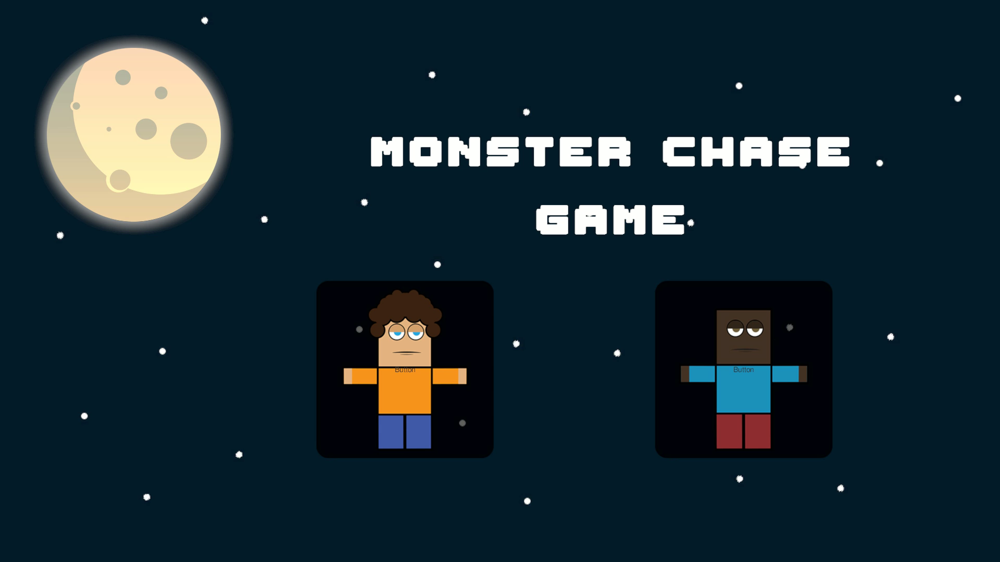

# Monster Chase 🎮


A 2D platformer game where players evade respawning monsters. Developed in Unity as part of game development learning journey.



## Game Overview 🕹️
Control your character to survive endless monster waves!

## Key Features ✨
- **Intuitive Controls**
  - ➡️ Right Arrow: Move right
  - ⬅️ Left Arrow: Move left
  - ⏺️ Space: Jump

- **Player Mechanics**
    - Jump force customization
    - Collision detection

- **Game UI**
  - Main menu system

## Installation 🛠️
1. Clone repository:
```
bash
   git clone https://github.com/alsongard/monster-chase.git
```

Open in Unity Hub:  
Requires Unity 2021.3 or newer  
>>>Import all assets  
Open scene:   
>>>Assets/Scenes/monster_game.unity  

Controls 🎯
| Action |	Key |
| --- | --- |
| Move | Left 	← Left Arrow  |
| Move | Right 	→ Right Arrow  |
| Jump |	Space  |


Acknowledgements 🎓  S
Developed as part of game development studies with gratitude to:  

* [freeCodeCamp](https://youtu.be/gB1F9G0JXOo?si=aOPV8tLQn9NVXTqq) for educational resources
* Unity Technologies for game engine
* OpenGameArt.org for free assets


## Video
[monster_chasing_game_001.webm](https://github.com/user-attachments/assets/18914723-eba8-423e-8961-208efb501438)


License 📄
GNUv2 
